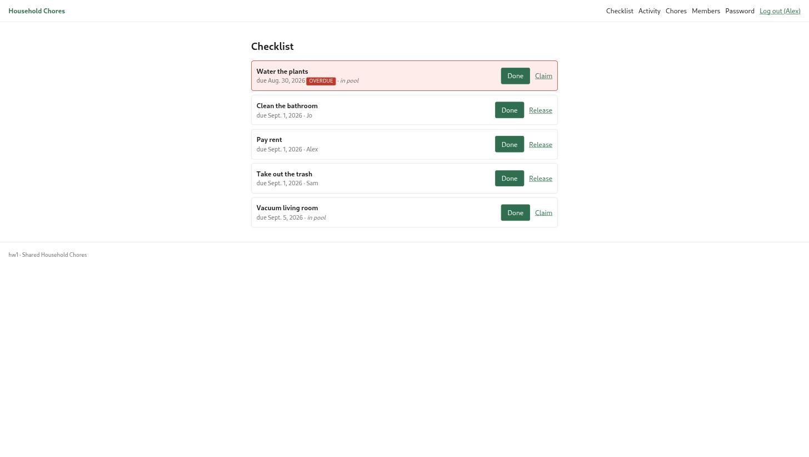
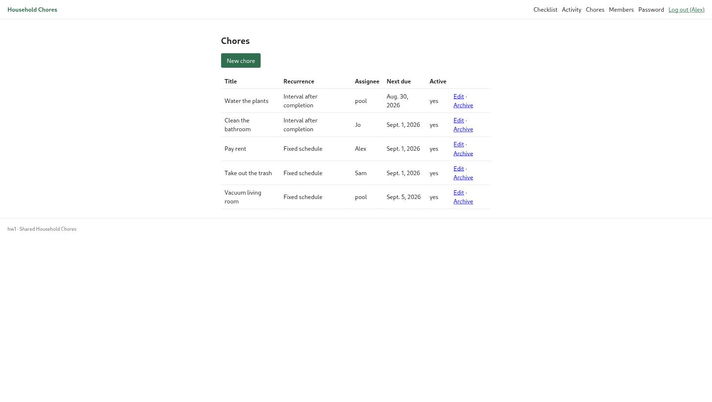
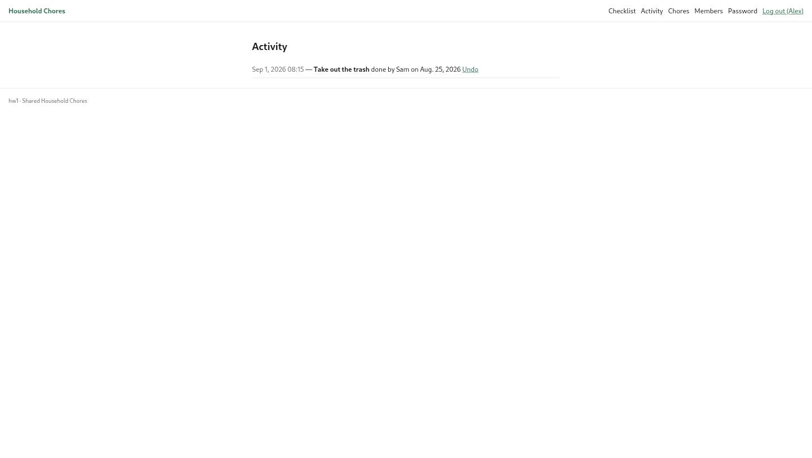
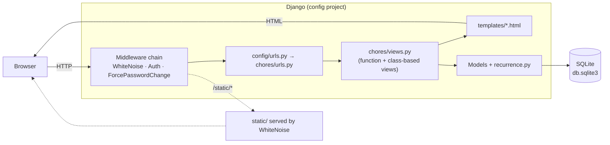

# Household Chores

A web app that lets a household share one chore list. One person runs the
household and adds everyone else; from then on any member can see what's due,
claim a task from the shared pool or finish one that's assigned to them, and the
app keeps a running history of who did what. It exists because a fridge whiteboard
doesn't remind anyone, doesn't say whose turn it is, and doesn't survive being
wiped.

- **Stack:** Django 6.1 · Python 3.13 · SQLite · WhiteNoise
- **Status:** v1 feature-complete · **111 automated tests** passing · CI green
- **Deployment:** none yet — runs locally (see [Quickstart](#quickstart))

---

## Contents

- [The problem](#the-problem)
- [Demo](#demo)
- [Does it work? — testing](#does-it-work--testing)
- [Quickstart](#quickstart)
- [Configuration](#configuration)
- [Running the app](#running-the-app)
- [How it's built](#how-its-built)
  - [Architecture](#architecture)
  - [Data model](#data-model)
  - [Project structure](#project-structure)
  - [Design decisions and trade-offs](#design-decisions-and-trade-offs)
  - [CI](#ci)
- [Scope and limitations](#scope-and-limitations)
- [Future work](#future-work)
- [Project docs](#project-docs)

---

## The problem

People sharing a home need to split recurring chores, and the usual tools don't
help:

- A whiteboard or group chat has **no sense of "due"** — a weekly task doesn't
  reappear, and nothing is flagged when it's been skipped.
- **Whose turn it is** gets argued about instead of recorded.
- There's **no history**, so "I did it last time" can't be checked.
- Shared to-do apps assume every task has one owner; a household wants a mix of
  *assigned* chores and a *free-for-all pool*.

This app is deliberately small and trust-based: there's no points system, no
leaderboard, no nagging notifications. It just keeps an honest, shared list and a
log. The full scope — including what was consciously left out — is in
[`SCOPE.md`](SCOPE.md).

**Who it's for:** roommates, families, or shared houses — anywhere a few people
split housework and one of them is willing to be the organiser.

---

## Demo

No hosted instance yet. To see it working, load the demo data and start the
server (details in [Quickstart](#quickstart)):

```bash
python manage.py seed_demo
python manage.py runserver
# open http://127.0.0.1:8000/ and log in as  alex / demo-pass-123
```

`seed_demo` creates the **"Maple Street"** household: `alex` (admin) plus members
`sam` and `jo` (same password, both prompted to set their own on first login),
five chores with a mix of schedules and assignments, one overdue task, and a
completed one in the log.

### The checklist

Every member's home screen. Overdue chores are flagged and sorted to the top;
each row shows the due date and either the assignee or "in pool". Anyone can hit
**Done** on any chore. Pool chores show **Claim**; a chore you hold shows
**Release**.



### Managing chores (admin only)

The admin defines chores and their recurrence, reassigns them, or archives ones
the household no longer does.



### Activity log

A household-wide history of completions, newest first. The admin gets an
**Undo** link that reverses a completion and restores the chore's previous due
date and assignee.



---

## Does it work? — testing

The app has **111 tests** ([`chores/tests/`](chores/tests/)). They run in about a
second and a half, and cover the recurrence maths, the model helpers, and every
view's behaviour and access rules.

```bash
python manage.py test        # 111 tests
ruff check .                 # lint
python manage.py check       # Django system checks
```

| Test module | Count | What it covers |
|---|---:|---|
| `test_recurrence.py` | 20 | Weekly (multi-day, week/month/year wrap, strictly-after, empty), monthly (later this month, rollover, Feb + 30-day clamp), interval, dispatch, initial-due, unknown type |
| `test_models.py` | 10 | `is_household_admin`, `__str__`, `in_pool`, `is_overdue` (past/today/future/none), `set_initial_due`, `advance_due`, `is_undone` |
| `test_auth.py` | 15 | Signup (create / password mismatch / duplicate / redirect-if-authed), login (redirect, `?next`, inactive user), logout is POST-only, forced-password-change middleware |
| `test_checklist.py` | 20 | Household scoping, overdue-first ordering, empty state, claim/release rules, complete → advance due + snapshot + return to pool, cross-household 404s |
| `test_chores_admin.py` | 17 | Member 403 / anon redirect / cross-household 404, create weekly-monthly-interval + validation errors, assignee choice scoping, edit, archive semantics |
| `test_members.py` | 15 | List scoping, create (password required, login works, second admin), edit (keep vs. reset password), activate/deactivate (self-guard, member 403, POST-only, inactive can't log in) |
| `test_activity.py` | 12 | Scoping, newest-first, pagination, empty state, undo-link visibility; undo restores state, member 403, no double-undo, cross-household 404, POST-only |
| `test_home.py` | 2 | Landing page for anonymous, redirect to checklist when logged in |

Tests use a fast password hasher (set automatically when `test` is in
`sys.argv`), so the auth-heavy suite stays quick. There is no separate database
or service to start — `manage.py test` is enough.

**No coverage measurement is wired up** and there are no browser/end-to-end
tests; see [Limitations](#scope-and-limitations).

---

## Quickstart

**Prerequisites:** Python 3.13 and `pip`. Nothing else — the database is SQLite
and there are no external services.

```bash
git clone https://github.com/bergimax/hw1.git
cd hw1

python3 -m venv .venv
source .venv/bin/activate            # Windows: .venv\Scripts\activate
pip install -r requirements.txt

cp .env.example .env                 # optional — sensible defaults without it
python manage.py migrate
python manage.py seed_demo           # optional demo data
python manage.py runserver
```

Open <http://127.0.0.1:8000/>. Create a household at `/signup/`, or log in with
the demo account (`alex` / `demo-pass-123`) if you ran `seed_demo`.

---

## Configuration

All configuration is through environment variables, read from a `.env` file in
the project root if present (see [`.env.example`](.env.example)). Every variable
has a development default, so the app runs with no `.env` at all.

| Variable | Required | Default | Purpose |
|---|---|---|---|
| `SECRET_KEY` | Production only | insecure dev key | Django cryptographic signing key |
| `DEBUG` | No | `True` | Debug mode and error pages |
| `ALLOWED_HOSTS` | Production only | `localhost,127.0.0.1` | Comma-separated hostnames the app will serve |

There are **no API keys or third-party credentials.** The only data input is the
optional `seed_demo` management command; there is no external dataset to
download.

---

## Running the app

**Development server:**

```bash
python manage.py runserver
```

**Django admin** (for inspecting data directly) — create a superuser first:

```bash
python manage.py createsuperuser
# then visit http://127.0.0.1:8000/admin/
```

**Reset the demo data:**

```bash
python manage.py seed_demo --reset
```

**Key URLs:**

| Path | Who | What |
|---|---|---|
| `/` | anyone | Landing page; redirects to the checklist when logged in |
| `/signup/` | anyone | Create a household and become its admin |
| `/accounts/login/`, `/accounts/logout/` | anyone | Session auth |
| `/accounts/password_change/` | members | Change password (forced on first login for provisioned accounts) |
| `/checklist/` | members | The shared checklist; claim / release / mark done |
| `/activity/` | members | Completion history; admin can undo |
| `/manage/chores/` | admin | Define, edit, archive chores |
| `/manage/members/` | admin | Add, edit, activate/deactivate members |
| `/admin/` | superuser | Django admin |

---

## How it's built

### Architecture

A single Django project. No message queue, no cache server, no external APIs —
requests come in, the view reads or writes SQLite through the ORM, a template
renders, and the response goes back.



Two pieces carry most of the domain logic:

- **`chores/recurrence.py`** — pure date arithmetic (no database) that answers
  "when is this chore next due?" for both schedule types. Isolating it keeps it
  trivially testable.
- **`chores/middleware.py`** — `ForcePasswordChangeMiddleware` redirects any
  provisioned account with `must_change_password` set to the change-password
  form until they've set their own, so no individual view has to remember to
  check.

### Data model

Four models, all in [`chores/models.py`](chores/models.py):

| Model | Purpose | Notable fields |
|---|---|---|
| `Household` | Tenant boundary — every other row belongs to exactly one | `name` |
| `User` (extends `AbstractUser`) | A person; `role` is `admin` or `member` | `household` FK, `role`, `display_name`, `must_change_password` |
| `Chore` | A chore definition + its current state | `recurrence_type`, `recurrence_config` (JSON), `assignee` (null = in the pool), `next_due_on`, `active` |
| `ChoreCompletion` | One "marked done" event, and its undo | `completed_by`, `completed_on`, `prev_due_on` + `prev_assignee` (snapshot for undo), `undone_by`, `undone_at` |

`recurrence_config` is a small JSON blob whose shape depends on `recurrence_type`:

```jsonc
// fixed, weekly:   {"freq": "weekly", "weekdays": [0, 3]}   // Mon=0 … Sun=6
// fixed, monthly:  {"freq": "monthly", "day": 15}           // clamped to month length
// interval:        {"days": 3}                              // 3 days after last completion
```

### Project structure

```
hw1/
├── config/                  # Django project: settings, root urls, wsgi/asgi
├── chores/                  # the one app
│   ├── models.py            # Household, User, Chore, ChoreCompletion
│   ├── recurrence.py        # pure date maths for "next due" (no DB)
│   ├── views.py             # checklist, claim/release/complete, chore & member CRUD, activity, undo
│   ├── forms.py             # signup, member, chore (with recurrence sub-fields)
│   ├── mixins.py            # HouseholdScopedMixin / HouseholdAdminMixin — per-household access control
│   ├── middleware.py        # ForcePasswordChangeMiddleware
│   ├── admin.py             # Django admin registrations
│   ├── migrations/
│   ├── management/commands/
│   │   └── seed_demo.py     # demo household + data
│   └── tests/               # 111 tests + factories.py
├── templates/               # base.html + one template per screen
├── static/css/app.css       # hand-written CSS, no framework
├── _docs/                   # SCOPE is at repo root; plan / backlog / screenshots here
│   ├── plan.md              # phased build plan
│   ├── backlog.md           # the 22 tasks the build was broken into
│   └── img/                 # README screenshots
├── .github/workflows/ci.yml # lint + checks + tests on every push / PR
├── SCOPE.md                 # locked v1 scope, out-of-scope list, deferred decisions
├── requirements.txt
└── pyproject.toml           # ruff config
```

### Design decisions and trade-offs

**Extend `AbstractUser` rather than build email-only auth.**
The admin provisions accounts with a username and a temporary password shared
out of band — there is no email server in scope. Keeping Django's built-in
username/password machinery meant login, logout, password validation and the
password-change flow all came for free. The cost is carrying `first_name` /
`last_name` fields the app ignores in favour of `display_name`.

**Store `next_due_on` on the row instead of computing it on read.**
The checklist sorts by due date and flags overdue chores. With the date
denormalised onto `Chore`, that's one indexed query; computing it per-request
from completion history would be far more code and slower. The trade-off is that
completing a chore (and undoing that) has to keep the field correct — which is
exactly what the `ChoreCompletion` snapshot fields and the tests around them are
for.

**"Delete a chore" is a soft archive (`active = False`).**
A hard delete would cascade and wipe that chore's rows from the activity log,
which is the one piece of history the app promises to keep. Archiving drops the
chore off the checklist and clears its assignee while leaving the log intact.

**Calendar-date-only due dates, no time zones.**
Households are usually in one place and think in days ("bins go out Tuesday"),
not timestamps. `next_due_on` is a `DateField`; "overdue" flips at local
midnight. This is a deliberate scope cut recorded in [`SCOPE.md`](SCOPE.md).

**Function-based views for the small state changes, class-based for CRUD.**
Claim, release, complete, toggle-active and undo are short POST handlers — a
plain function with `@require_POST` is clearer than a CBV. The chore and member
CRUD screens are exactly what `CreateView` / `UpdateView` / `ListView` are for,
wrapped in two mixins (`HouseholdScopedMixin`, `HouseholdAdminMixin`) that scope
every queryset to the current household so cross-household access returns 404.

**SQLite and WhiteNoise.**
For a single-household-scale app with no deployment target yet, SQLite needs
zero setup and WhiteNoise serves static files from the app process — no second
service. Moving to Postgres later is a settings change plus a migration.

### CI

[`.github/workflows/ci.yml`](.github/workflows/ci.yml) runs on every push to
`main` and every pull request:

1. Install dependencies (`requirements.txt` + `ruff`)
2. `ruff check .` — lint
3. `python manage.py check` — Django system checks
4. `python manage.py test --verbosity 2` — the full suite

A failure blocks the run; there is **no deployment step** because there is no
deployment target yet.

---

## Scope and limitations

What this version deliberately does **not** do (full list in
[`SCOPE.md`](SCOPE.md)):

- **No automatic rotation.** Chores are assigned by the admin or claimed from
  the pool; the app never says "it's your turn this week".
- **No scoring or fairness tracking.** No points, no counts, no "who's done
  the least". It's a shared list, not a scoreboard.
- **No notifications.** Members see state only when they open the app — no
  email, no push, no reminders.
- **One household per user.** A person belongs to exactly one household; there's
  no household switcher.
- **No self-service signup for members.** Only the admin creates member
  accounts, and only via a username + temporary password (no email invites).
- **No deployment / no HTTPS config / no `Procfile`.** Runs locally only.
- **No end-to-end tests and no coverage report.** The 111 tests are Django
  `TestCase` unit/integration tests exercised through the test client.
- **Missed chores don't stack or reassign.** An overdue weekly chore stays a
  single flagged row; it doesn't become two next week.

## Future work

Roughly in priority order, and following from the limitations above:

1. **Rotation as a third assignment mode** — cycle a chore through a list of
   members automatically. The data model already has `assignee`; this is mostly
   a scheduling function next to `recurrence.py`.
2. **Deployment** — a `Procfile`/container, Postgres via `DATABASE_URL`, and a
   deploy step in CI once a host is chosen.
3. **Email invites** so the admin isn't hand-delivering passwords.
4. **Coverage reporting** in CI, and a small Playwright smoke test for the
   claim → done → undo path.
5. **Per-member "my chores" filter** on the checklist for larger households.

## Project docs

- [`SCOPE.md`](SCOPE.md) — locked v1 scope, out-of-scope items, deferred decisions
- [`_docs/plan.md`](_docs/plan.md) — the phased build plan
- [`_docs/backlog.md`](_docs/backlog.md) — the 22 tasks (T1–T22) the build was broken into
